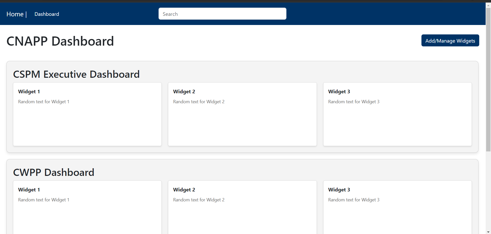
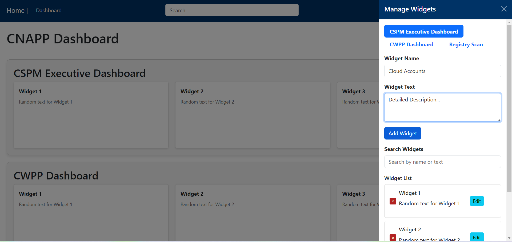

# CNAPP Dashboard

## Description

CNAPP Dashboard is a React-based application for managing and visualizing widgets within categories. It features a user-friendly interface for adding, updating, and removing widgets, as well as viewing them organized by categories. The application uses Redux for state management and React-Bootstrap for UI components.

<p align="center">
  
  
</p>

## Features

- **Dashboard View:** Displays categories and their associated widgets.
- **Offcanvas Management:** Allows users to add, edit, and remove widgets via an off-canvas sidebar.
- **State Management:** Utilizes Redux for managing widget state across the application.

## Technologies Used

- **React:** JavaScript library for building user interfaces.
- **Redux:** State management library for handling global state.
- **React-Bootstrap:** Bootstrap components for React.
- **Redux Toolkit:** Simplifies Redux state management.

## Installation

1. Clone the repository:
   ```bash
   git clone https://github.com/yourusername/cnapp-dashboard.git
2. Change to the project directory:
    ```bash
    cd cnapp-dashboard
3. Install the necessary npm packages:
   ```bash
   npm install
4. Start the development server to run the application:
   ```bash
   npm start
5. This will compile the application and start a local server. By default, it will be available at http://localhost:3000.
6. Open your web browser and navigate to http://localhost:3000 to view the running application.
7. Once the application is running, click on the "Add/Manage Widgets" button located at the top right of the dashboard to configure widgets within each category.
